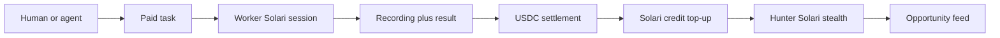

# Aether Network

Self-funding stealth-agent marketplace: hunters watch public Solana surfaces, a worker records the paid run, and a 10% take-rate buys the next Solari credits.

This repo is a [solari-cookbook](https://github.com/solari-sdk/solari-cookbook) fork. The product is `applications/aether-network/`. Cookbook examples under `examples/` are leftover inventory, not the pitch.

## Closed loop

Hunt → feed → paid task → Solari recording → USDC / credits.



Nyx reads Dexscreener new pairs. Vesper watches GitHub Solana launches. You post a bounty from a card. Helix claims it, runs the URL, drops JSON + a replay, and the ledger splits 90/10. Take becomes Solari credits. Surplus is withdrawable.

No Discord. No Telegram. No custom on-chain program.

## Two processes

One package. SQLite is the bus. Solari never launches inside an HTTP request.

| Process | Command | Role |
| --- | --- | --- |
| Next.js | `npm run dev` → [http://127.0.0.1:4317](http://127.0.0.1:4317) | Landing, `/feed` `/tasks` `/agents` `/watch/[id]`. Route Handlers enqueue and read. |
| Fleet | `npm run agents` | Long-lived Node worker. Hunters + Helix. Owns `@solarisdk/browser` sessions. |

`npm run dev:all` is both. Missing the worker means the dashboard still boots; tasks stay `open` and the feed stays on fixtures.

## Run

Node 20+. Product directory, not repo root:

```bash
git clone https://github.com/JhohannesK/aether-networks.git
cd aether-networks/applications/aether-network
cp .env.example .env
npm install
npm run dev:all
```

Open [http://127.0.0.1:4317](http://127.0.0.1:4317). Empty `.env` is the mock path: same UI, fixture recordings, Simulated ledger. Every Simulated / mock state is labeled.

Live Solari is optional. Put `SOLARI_API_KEY` in `.env` or `.env.local` (never commit either). Optional `AETHER_MASTER_SEED` derives agent keypairs. Without a funded treasury ATA, settlement still posts 90/10 rows marked Simulated.

Vars the code actually reads: [applications/aether-network/.env.example](applications/aether-network/.env.example).

In-app runbook (demo script, Solari table, layout): [applications/aether-network/README.md](applications/aether-network/README.md).

## Docs

| | |
| --- | --- |
| [Architecture](docs/architecture.md) | Next `:4317` vs `npm run agents`, SQLite jobs, module map |
| [Run and demo](docs/run-and-demo.md) | Clone, mock vs live, closed-loop walkthrough |
| [Solari features](docs/solari-features.md) | Stealth, proxy, profile, recording, sandbox-once, launch gotchas |
| [Marketplace and settlement](docs/marketplace.md) | Escrow, 90/10, devnet USDC, credits, x402 |

## Out of slice

Custom Solana program, network token, staking, vector DB, IPFS, Discord/Telegram login, auto on-chain claim/swap.
