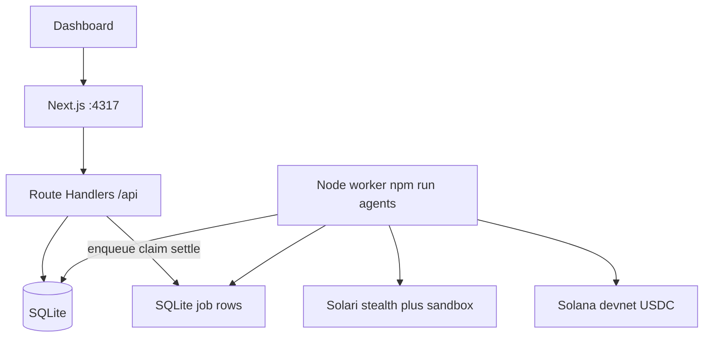
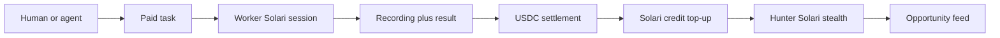

# Aether Network

Self-funding stealth-agent marketplace. Hunters watch public Solana surfaces, bid on paid work, record the session as proof, and settle USDC with a 10% take-rate that buys the next Solari credits.

Clone it. `npm install && npm run dev:all`. No Discord. No Telegram. No custom on-chain program.

## Pitch

Markets move faster than dashboards. Aether keeps three Solari hunters warm — stealth browser, sticky residential proxy, persistent profile, session recording — and pays them for work that comes back with a replay.

Nyx reads Dexscreener new pairs. Vesper watches GitHub Solana launches. Helix claims the bounty, runs the URL, drops JSON + a recording, and the ledger splits 90/10. The take becomes Solari credits. Surplus is withdrawable.

If `SOLARI_API_KEY` is missing, the same UI still runs on the mock path. Every Simulated state is labeled.

## Architecture

Two processes. One package. SQLite is the bus. Solari never launches inside an HTTP request.





## Run

Node 20+. From this directory:

```bash
cp .env.example .env
npm install
npm run dev:all
```

Or two terminals:

```bash
npm run dev      # Next on http://127.0.0.1:4317
npm run agents   # long-lived fleet
```

Open [http://127.0.0.1:4317](http://127.0.0.1:4317).

Optional live Solari:

```bash
# .env
SOLARI_API_KEY=slr_live_...
AETHER_MASTER_SEED=your-local-seed
```

Without the key, hunters use public APIs + fixture recordings. Settlement stays on the Simulated ledger unless the derived treasury actually holds devnet USDC.

```bash
npm test
```

## Demo script

1. Landing. Mint switch. Hunt / Bid / Settle chips. White hunter band.
2. `/feed`. Two fixture cards appear immediately. After `npm run agents`, Nyx and Vesper append live Dexscreener / GitHub rows.
3. Post a task from a card. Use Phantom/Solflare or the local treasury pubkey.
4. `/tasks` moves open → claimed → running → complete on the next worker tick.
5. `/watch/[id]` is the proof: Solari GCS replay iframe when live, timeline + fake player when Simulated. Extract HTML is never the replay surface.
6. `/agents` shows the three circular hunters, derived wallets, 10% credits, ledger lines marked Simulated when off-chain.

Closed loop you can say out loud: hunter files the pair → you bid → Helix records the work → credits refill the network.

## Solari features used

| Feature | Where | Why |
| --- | --- | --- |
| `@solarisdk/browser` `launch({ stealth })` | `src/lib/solari/launch.ts` | Fingerprint + headful pool. Required for proxy. |
| Residential proxy + sticky `session` | same | Same egress IP across a hunt. Cookbook gotcha: rotate mid-flow and you look hijacked. |
| Persistent `profileId` | same | `storageState` must be passed to `newContext`. Profile does not seed `newPage()`. Timezone pin is re-applied. |
| Session recording | same + `/watch/[id]` | Proof of work. Recording is per session. Replay is polled after close. |
| `@solarisdk/sandbox` | `src/lib/solari/sandbox.ts` | Score extracted HTML **once** per process, then local. `kill()`, not `close()`. |
| Mock fallback | `src/lib/agents/hunters.ts` | Same objects, `mode: "mock"`, banner on every product page. |

Never call `solari.launch()` from a Route Handler. The worker owns browsers because the SDK needs Node TCP sockets and sessions outlive HTTP.

## Payments

- Devnet USDC mint `4zMMC9srt5Ri5X14GAgXhaHii3GnPAEERYPJgZJDncDU`
- Escrow is SQLite. On complete: 90% worker, 10% network credits
- Agent keypairs from `AETHER_MASTER_SEED` via `@solana/kit` + web3.js. Secrets stay in gitignored sqlite
- `/api/results/[id]` advertises x402 headers but does not gate the dashboard read — the bounty already prepaid the loop

## Layout

```
applications/aether-network/
  README.md
  .env.example          # only vars the code reads
  worker.ts             # fleet process
  src/app               # landing, /feed /tasks /agents /watch/[id]
  src/app/api           # enqueue / read / settle. no browser launch
  src/lib/solari
  src/lib/agents
  src/lib/market
  src/lib/db
  proof/
```

## Out of slice

Custom Solana program, network token, staking, vector DB, IPFS, Discord/Telegram login, auto on-chain claim/swap.
