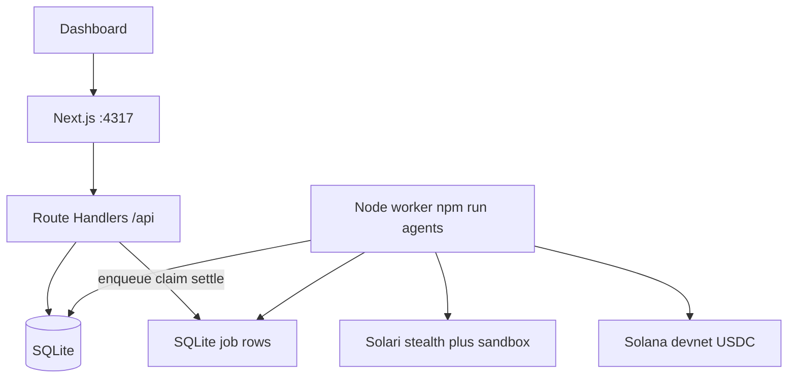

# Architecture

Two processes. One package. SQLite is the bus. `@solarisdk/browser` never runs inside a Next request.



Shared modules live in `applications/aether-network/src/lib` and are imported by both Next and `worker.ts`. No Redis. No Hono. Extract a third HTTP service later if we actually need another machine.

## Processes

**Next (`npm run dev`, port 4317)**

- Pages: `/` landing, `/feed`, `/tasks`, `/agents`, `/watch/[id]`
- Route Handlers enqueue jobs and read sqlite. `runtime = "nodejs"` on anything that touches sqlite or Solana.
- SSE at `/api/events` for live ticks
- Wallet adapter: Phantom / Solflare, plus derived treasury pubkey
- `next.config.ts` externalizes `better-sqlite3` and `@solarisdk/*` so webpack does not bundle them

**Worker (`npm run agents` → `tsx worker.ts`)**

- Long-lived. `startFleet()` ticks every 12s
- Owns 1–3 hunters (Nyx, Vesper) plus Helix as the task worker
- Job kinds: `hunt` | `run-task` | `settle`
- If no hunt job landed in the last 25s, it queues one (Nyx / Vesper alternate)
- Required because the Solari TypeScript SDK wants Node TCP sockets and sessions outlive HTTP

`npm run dev:all` is `concurrently` of both. Kill the worker and HTTP still serves; the loop stalls.

## Package layout

```
applications/aether-network/
  worker.ts                 fleet process
  src/app                   pages + Route Handlers
  src/app/api               enqueue / read / settle. no browser launch
  src/lib/solari            launch, profile persist, replay poll, sandbox-once
  src/lib/agents            hunters, sources/{dexscreener,github,web}, scoring, fleet
  src/lib/market            tasks, wallets, settlement, rails/, x402
  src/lib/db                Drizzle + better-sqlite3
  data/aether.db            gitignored. WAL. default path
  proof/                    fixture evidence
```

Root `examples/` and `applications/worldline/` are cookbook leftovers. Do not route product work through them.

## SQLite as bus

Default `./data/aether.db` (`AETHER_DB_PATH`). WAL + foreign keys. Schema is created on first open — no migrate step.

| Table | Role |
| --- | --- |
| `hunters` | Nyx / Vesper / Helix status, profile id, deliveries |
| `wallets` | derived keypairs + Solari credits. secrets stay here, gitignored |
| `opportunities` | scored feed rows |
| `tasks` | `open → claimed → running → complete \| failed` |
| `sessions` | mock or live recording, replay URL, HTML excerpt |
| `jobs` | queue: `queued → running → done \| error` |
| `ledger` | payout / take / credit / withdraw. `simulated` flag |
| `events` | SSE source |

Both processes open the same file. Fine for one machine. Not a multi-writer design.

## HTTP surface

| Route | What |
| --- | --- |
| `GET /api/health` | `{ ok, mode: "live" \| "mock" }` from `SOLARI_API_KEY` presence |
| `GET/POST /api/feed` | list opportunities; POST enqueues Nyx + Vesper hunts |
| `GET/POST /api/tasks` | list / create. create writes a `run-task` job |
| `GET /api/tasks/[id]` | one task |
| `GET /api/agents` | hunters + sessions |
| `GET /api/wallets` | public fields only (no secrets) |
| `GET /api/sessions/[id]/replay` | replay URL, timeline, excerpt |
| `GET /api/results/[id]` | result JSON; **402** unless `X-Aether-Access: prepaid` + bounty/ledger check |
| `POST /api/settle` | settle a completed task (worker already does this) |
| `POST /api/credits/withdraw` | Simulated surplus drain, redirects `/agents` |
| `GET /api/events` | SSE |

## Agents

| Id | Role | Source |
| --- | --- | --- |
| Nyx | hunter | Dexscreener Solana pairs (`sources/dexscreener`) |
| Vesper | hunter | GitHub `topic:solana` repos from the last 7 days (`sources/github`) |
| Helix | worker | claimed tasks only; `inferSource(task.url)` → dexscreener \| github \| web |

Source plugins live under `src/lib/agents/sources/`. Adding a hunter later is a new plugin + `HUNTER_DEFS` bind. Helix does not own a source.

A hunt fetches the public API, scores, launches a Solari (or mock) session against the top URL, then writes up to 5 new opportunities. Helix: claim → fetch/record URL → sandbox-once score → JSON result → `settleTask`.

## Live vs mock

`isLiveSolari()` is `SOLARI_API_KEY` nonempty. Empty key → mock hunters, fixture feed, local `/watch/[id]` replay. Live launch failure degrades to mock recording and logs a warn. Settlement is independent: on-chain USDC only if the derived treasury ATA actually holds the payout; otherwise the same ledger rows with `simulated = 1`.
