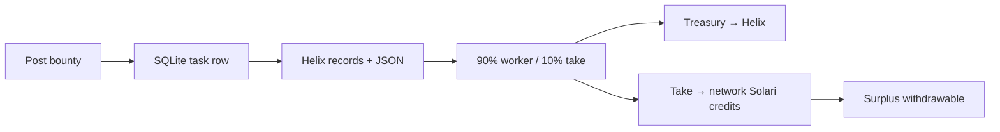

# Marketplace and settlement

Escrow is sqlite. Chain is optional. UI states are the same either way; Simulated is labeled.



## Wallets

Derived from `AETHER_MASTER_SEED` (fallback `aether-local-dev-seed`) via `sha256(seed/path)` → ed25519 seed. Paths: `treasury`, `network`, `hunter/nyx`, `hunter/vesper`, `hunter/helix`.

`listWallets()` strips `secret`. Secrets live in gitignored sqlite only. Do not log them. Do not commit `data/`.

| Id | Role | Pays / receives |
| --- | --- | --- |
| `treasury` | marketplace float | Sends payout + take on settle |
| `network` | take-rate sink | Credits + withdrawable surplus |
| `nyx` / `vesper` / `helix` | agent | Helix receives the 90% |

Seeded credits: network starts at 12.5 Solari credits, 2.5 withdrawable, so `/agents` is not an empty ledger on first paint.

Change the seed before any real funds. Default seed is for local demo, not a vault.

## Task loop

`createTask` writes `status: "open"` and a `run-task` job. Fleet:

1. Helix claims (`claimed`) then `running`
2. Fetch / record the URL, score HTML once, write `resultJson` + `sessionId`
3. `complete` (or `failed` with error JSON)
4. `settleTask(taskId)` in the same job

Statuses: `open | claimed | running | complete | failed`. Poster wallet is optional (Phantom / Solflare / treasury pubkey). Bounty default 10 USDC if the POST omits a positive amount.

## Split

`TAKE_RATE = 0.1`. `splitBounty` is 90% payout / 10% take, rounded to cents.

On settle, three ledger rows:

| Type | Amount | From → to | Simulated? |
| --- | --- | --- | --- |
| `payout` | 90% | treasury → Helix (or assigned hunter) | 0 if USDC transfer landed |
| `take` | 10% | treasury → network | same flag as payout |
| `credit` | 10% | network → network | always Simulated — Solari balance is not an on-chain mint |

Idempotent on `ledger.type === "payout"` for that `taskId`. Network wallet `solariCredits` and `withdrawable` increment by the take.

## On-chain USDC

- Network: Solana **devnet**
- Mint: `4zMMC9srt5Ri5X14GAgXhaHii3GnPAEERYPJgZJDncDU`
- Transfer: treasury ATA → worker ATA via `@solana/spl-token`
- Skip chain (return `{ ok: false }`) when there is no live Solari **and** no `SOLANA_RPC_URL`, when the ATA is missing, when the balance is short, or when `sendTransaction` throws

Unfunded treasury is the expected contest default. The dashboard still shows payout + credits; rows carry `simulated = 1` and `txSig = null`.

`tryUsdcTransfer` currently sends the **payout** only. The 10% take is booked in sqlite (and as credits). Do not claim two on-chain transfers if you only see one signature.

## Withdraw

`POST /api/credits/withdraw` drains 2.5 (or whatever is withdrawable, whichever is smaller) as a Simulated `withdraw` row and redirects `/agents`. No chain. Surplus is "marked withdrawn", not bridged.

## x402

`GET /api/results/[id]` advertises:

```
Payment-Protocol: x402
X-402-Asset: USDC
X-402-Network: solana-devnet
X-402-Amount: <bounty>
X-402-Required: false
```

Dashboard reads are prepaid by the posted bounty. Headers are the contest hook, not a gate.

## Out of slice

Custom program, network token, staking/reputation beyond Helix's delivery counter, auto claim/swap, IPFS/Arweave for replays (Solari hosts the recording).
